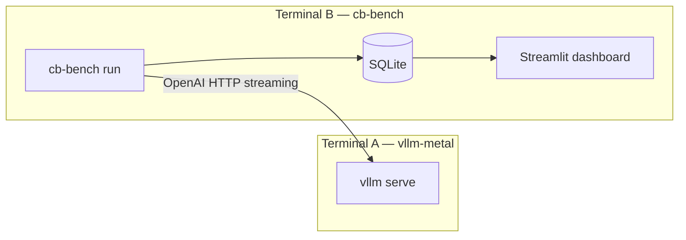
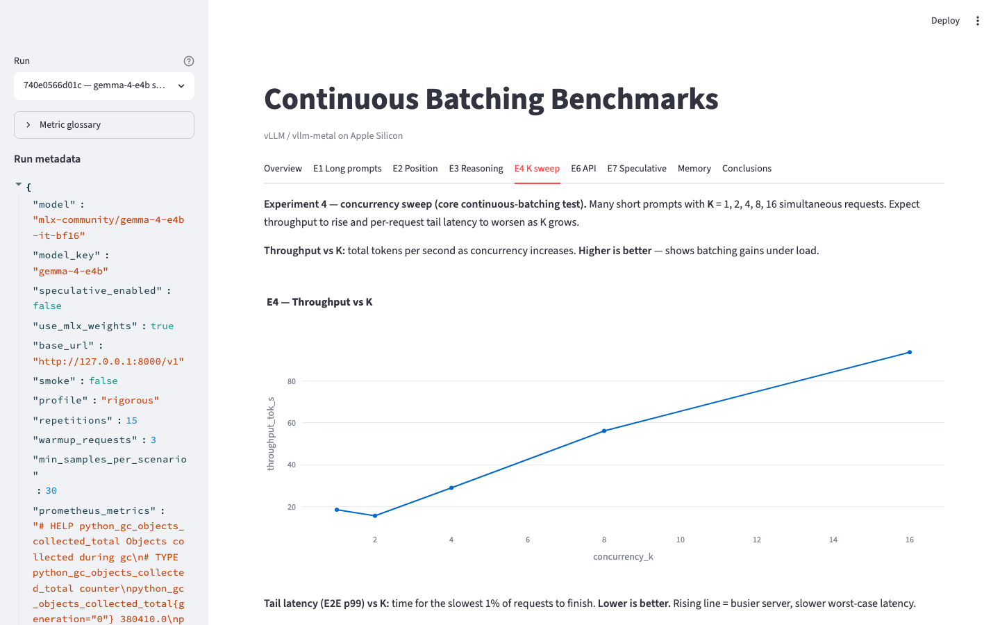
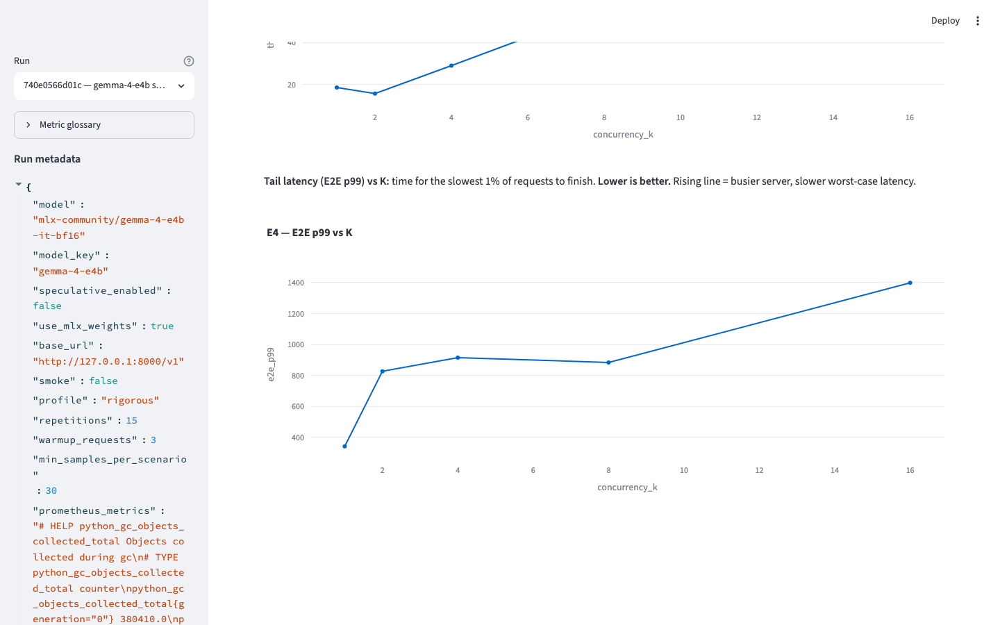
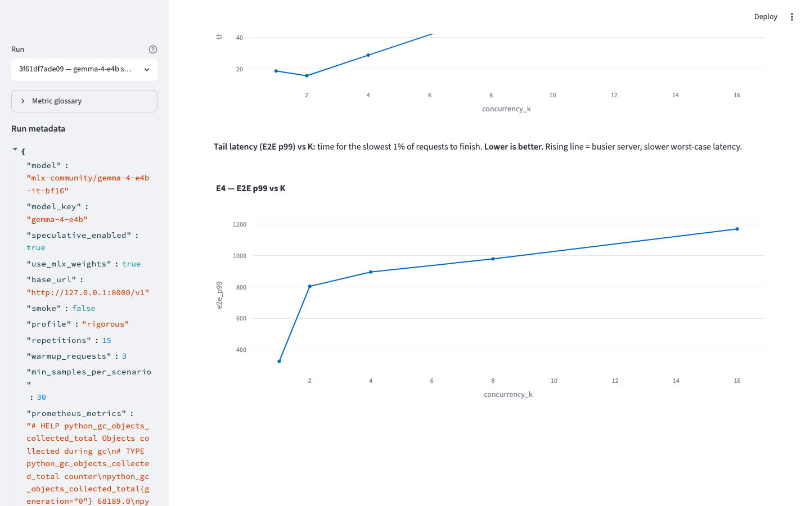
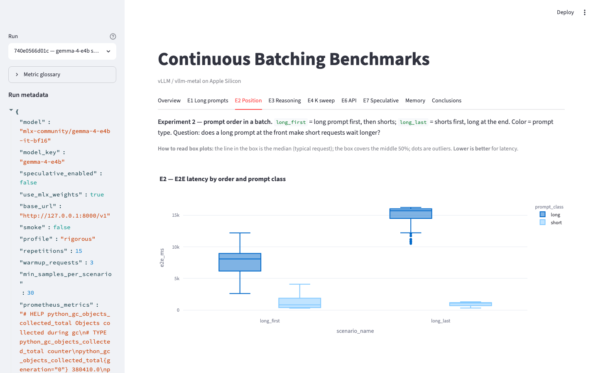
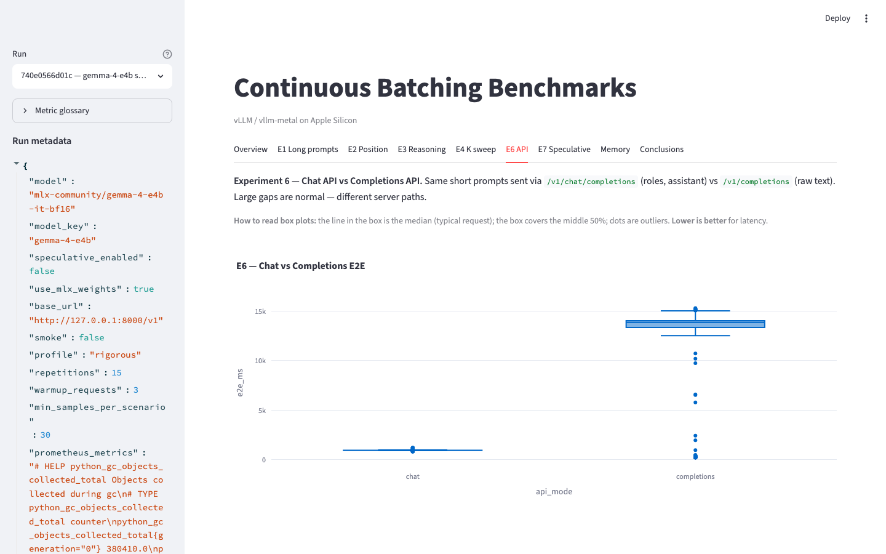

# Continuous Batching Benchmarks

A reproducible benchmark harness for measuring **latency**, **throughput**, and **memory** on Apple Silicon when serving LLMs with [vllm-metal](https://github.com/vllm-project/vllm-metal). The suite exercises **continuous batching** (client concurrency sweeps), **mixed prompt workloads**, and **speculative decoding** A/B comparisons across seven structured experiments (E1–E7).

**Documentation:** [Reproduction guide](docs/REPRODUCTION.md) · [Architecture walkthrough](docs/CODE_WALKTHROUGH.md) · [Sample results](docs/sample-results/)

---

## Overview

This repository separates concerns deliberately:

| Component | Role |
|-----------|------|
| **vLLM server** (`vllm serve` via vllm-metal) | Model inference, continuous batching, speculative decoding |
| **Benchmark client** (`cb-bench`) | HTTP load generation, metric collection, SQLite storage |
| **Streamlit dashboard** | Interactive exploration and auto-generated conclusions |

The client does not configure batching or speculation—it tags each run and sends realistic mixed workloads so you can compare server configurations under identical load.



---

## Results

I ran the full **rigorous** profile twice on Gemma 4 (`mlx-community/gemma-4-e4b-it-bf16`) with vllm-metal: once with speculative decoding off, once on (draft model `gemma-3-1b-it-qat-4bit`). Same HTTP client, same prompts, same concurrency levels — ~7,665 measured requests per run. The numbers below come straight from those SQLite runs; the screenshots are from `make dashboard` (pick a run in the sidebar, same as you would locally).

### Continuous batching actually moves the needle

Experiment E4 hammers the server with short prompts at K = 1, 2, 4, 8, 16. With speculation off, throughput climbed from **18.3 tok/s** at K=1 to **91.7 tok/s** at K=16 — roughly **5×** more output for the same model. That is the whole point of serving with batching enabled.

The cost shows up in tail latency. Median request time stayed under a second even at K=16, but **p99 went from 342 ms to 1,398 ms**. You are trading per-request worst-case latency for aggregate throughput, and at K=16 the trade is steep. There is also a small oddity at K=2 (throughput drops to 15.5 tok/s before recovering at K=4), which suggests very light concurrency is an awkward operating point on this stack — not enough batching benefit yet, but enough contention to hurt.

*Dashboard → E4 K sweep, speculative off (`740e0566d01c` in sidebar):*



### Speculative decoding mattered where the server was already busy

At K=1, turning speculation on changed almost nothing (**18.3 → 18.6 tok/s**). At K=16 it was a different story: **91.7 → 97.2 tok/s** (+6%) and p99 **1,398 → 1,169 ms** (−16%). The non-speculative run has a visible cliff at K=16; switch the sidebar run to spec on and the tail flattens. Draft speculation did not rescue low-concurrency latency — it helped when the batch was already full.

*Speculative off — tail latency:*



*Speculative on — same experiment, run `3f61df7ade09` in sidebar:*



### Prompt order in a mixed batch is not a detail

E2 puts one long prompt in a wave of shorts at concurrency 8. When the long prompt went **first**, short requests hit a **3.4 s** p99. When it went **last**, that dropped to **1.3 s** — the shorts stopped waiting behind a prefilled batch. The long prompt itself paid for that: its p99 went from **12.0 s** to **16.2 s**. Nothing magic about speculation here; it is queueing dynamics. If you care about short-request tails in a mixed workload, *when* the big request arrives matters as much as *how many* requests you send.



### Pick the right API before tuning the server

E6 sent identical short prompts through Chat and Completions. Chat landed at **941 ms** p50; Completions at **13.9 s**. Same model, same hardware — a **15×** gap from the API surface alone. Any conversation about batching or speculative decoding is secondary if the application path is wrong.



### Long outputs dominate; speculation nudges rather than transforms

On decode-heavy workloads (E7), p50 end-to-end times sat between **11 s and 28 s** depending on concurrency. Speculative on vs off moved throughput by **1–4%** and shaved a few percent off median latency — real, but small compared to the cost of generating tens of thousands of tokens. Reasoning prompts in E3 were worse still (**28–34 s** p50), though speculation did help there more noticeably (**−16%** on reasoning p50, **+15%** throughput).

---

Re-run the suite on your own Mac to see how these numbers shift on your chip and memory. After `make bench-gemma-off`, open `make dashboard` — you should see the same tabs, sidebar run picker, and charts. Full bullet exports: [`docs/sample-results/`](docs/sample-results/). To regenerate README screenshots: `make dashboard-screenshots` (with the dashboard running).

---

## Quick start

You need **two terminals** with **two virtual environments** inside this repo:

| | Terminal A — server | Terminal B — client |
|---|---------------------|---------------------|
| **Venv** | `.venv-vllm-metal` | `.venv` |
| **Purpose** | `vllm serve` | `cb-bench run`, dashboard |

> **Mac only.** Do not use the CUDA Docker image on Apple Silicon—it will not use the Metal GPU. Use native [vllm-metal](https://github.com/vllm-project/vllm-metal).

### Prerequisites

- Apple Silicon (M1–M4)
- Python 3.12+
- 32 GB unified memory recommended (Gemma 4 BF16 + draft speculative model)

### 1. Install

```bash
git clone https://github.com/Maximiliano-Villanueva/continuos-batching-bench.git
cd continuos-batching-bench

make install-vllm-metal          # server → .venv-vllm-metal/
python3 -m venv .venv
source .venv/bin/activate
make install-bench               # client → .venv/
make prompts-long                # ~8k-token prompts for E1/E3
```

### 2. Start the server (Terminal A)

```bash
./scripts/serve.sh gemma-4-e4b off
```

Wait for `http://127.0.0.1:8000/v1/models`. Keep this terminal open.

### 3. Run benchmarks (Terminal B)

```bash
source .venv/bin/activate
make serve-check
make smoke                       # optional connectivity check (~2–5 min)
make bench-gemma-off             # full suite (~5–6 h, ~8,730 requests)
```

### 4. Explore results

```bash
make dashboard                   # http://localhost:8501
make export                      # refresh CSV / Markdown exports
```

For speculative A/B: restart the server with `on`, then `make bench-gemma-on`. See [docs/REPRODUCTION.md](docs/REPRODUCTION.md) for the complete recipe.

---

## Experiments (E1–E7)

| ID | Question |
|----|----------|
| **E1** | How do long-only, mixed long/short, and short-only waves behave? |
| **E2** | Does long-prompt **position** in a concurrent wave affect tail latency? |
| **E3** | Reasoning (long output) vs plain long-context input |
| **E4** | Short-prompt throughput and latency vs client concurrency **K** (1–16) |
| **E5** | Short prompt with a large `max_tokens` budget |
| **E6** | **Chat** API vs **Completions** API |
| **E7** | Decode-heavy workload for speculative decoding comparison |

Experiments with both **sequential** (no overlap, K=1) and **concurrent** (K>1) modes isolate the effect of overlapping client requests. vLLM batches internally in all cases; the modes control how much load the client presents at once.

**Metrics glossary:** TTFT = time to first token · E2E = end-to-end latency · tok/s = output tokens per wall-clock second · K = max in-flight requests from this client.

---

## Models

Configured in [`configs/models.yaml`](configs/models.yaml):

| Key | Default checkpoint | Speculative strategy |
|-----|-------------------|----------------------|
| `gemma-4-e4b` | `mlx-community/gemma-4-e4b-it-bf16` | Draft model (`gemma-3-1b-it-qat-4bit`) |
| `qwen3.5-4b` | `mlx-community/Qwen3.5-4B-MLX-4bit` | Native MTP (`qwen3_next_mtp`) |

**Gemma on Metal:** use the BF16 checkpoint above. The 4-bit Gemma MLX build currently fails on vllm-metal (KV-shared weights / missing multimodal processor files). `scripts/serve.sh` applies text-only flags automatically (`--limit-mm-per-prompt.* 0`, `--max-model-len 8192`).

**Why mlx-community?** vllm-metal expects MLX-converted weights on Apple Silicon. The `mlx-community` Hugging Face org publishes ready-made checkpoints so you can skip manual conversion.

---

## Command reference

| Command | Description |
|---------|-------------|
| `make install-vllm-metal` | Install vLLM + vllm-metal into `.venv-vllm-metal/` |
| `make install-bench` | Install `cb-bench` into `.venv/` |
| `./scripts/serve.sh <model> off\|on` | Start the inference server |
| `make serve-check` | Health-check `http://127.0.0.1:8000/v1/models` |
| `make smoke` | Fast smoke test (~70 requests) |
| `make bench-gemma-off` / `on` | Full E1–E7, Gemma, speculative off/on |
| `make bench-qwen-off` / `on` | Full E1–E7, Qwen, speculative off/on |
| `make resume RUN_ID=… SPEC=on ONLY=E7` | Resume a partial run |
| `make estimate` | Print expected request counts (rigorous profile) |
| `make dashboard` | Launch Streamlit UI |
| `make export` | Export CSV/Markdown for the latest run |
| `make test` | Unit tests (no server required) |

CLI equivalents:

```bash
.venv/bin/cb-bench run --model gemma-4-e4b --speculative off
.venv/bin/cb-bench run --resume-run-id <run_id> --only-experiment E7
.venv/bin/cb-bench export --run-id <run_id>
```

---

## Rigorous profile

The default full-suite profile is **`rigorous`** in [`configs/experiments.yaml`](configs/experiments.yaml):

| Setting | Value |
|---------|-------|
| Repetitions per scenario | 15 |
| E4 wave size (short prompts) | 48 per K |
| Concurrency sweep | K = 1, 2, 4, 8, 16 |
| E1 long+short mix | 25 prompts per repetition |
| Warmup per scenario | 3 (discarded, not stored) |

**~8,730 measured requests** per full run (~8,800 HTTP calls including warmup). Use `make estimate` for a per-experiment breakdown. Use `make smoke` only to verify connectivity—not for drawing conclusions.

---

## Output layout

```
results/<run_id>/
  benchmark.db      # SQLite (all metrics)
  requests.csv      # per-request export
  summary.csv       # aggregated per scenario
  summary.md        # auto-generated conclusions
  summary.html
```

`results/` is gitignored. Committed sample summaries live under [`docs/sample-results/`](docs/sample-results/) for readers who do not re-run benchmarks.

---

## Monitoring

| Signal | Source |
|--------|--------|
| TTFT / E2E | Client streaming timestamps |
| Throughput | `output_tokens / wall_time` |
| Memory | `psutil` RSS sampled every 500 ms |
| GPU (optional) | `sudo ./scripts/sample_powermetrics.sh 60` |

---

## Project structure

```
configs/              models, experiments, active run defaults
scenarios/prompts/    JSONL prompt fixtures
src/continuous_batching/
  application/        orchestrator, scheduler
  domain/             types, prompt loading, model registry
  infrastructure/     HTTP client, SQLite store, monitor
  evaluation/         statistics, auto-conclusions
  reporting/          dashboard, export
scripts/              serve.sh, install, health checks
docs/                 reproduction guide, walkthrough, charts, sample results
tests/                unit + optional integration tests
```

---

## Troubleshooting

| Symptom | Resolution |
|---------|------------|
| `make serve-check` fails | Start `./scripts/serve.sh …` in Terminal A first |
| Dashboard shows no runs | Only directories with stored requests appear; run `make export` after a benchmark |
| `cb-bench` not found | Activate `.venv` or use Make targets (they invoke `.venv/bin/`) |
| Speculative server fails to start | Use `./scripts/serve.sh`—`--speculative-config` JSON quoting is handled there |
| CPU-only vLLM after install | Re-run `make install-vllm-metal` (installs the vllm-metal wheel explicitly) |
| Run interrupted | `make resume RUN_ID=<run_id> MODEL=gemma-4-e4b SPEC=on ONLY=E7` |

More detail: [docs/REPRODUCTION.md](docs/REPRODUCTION.md#troubleshooting).

---

## Tests

```bash
make test
pytest tests/integration -m integration   # requires a live vLLM server
```

---

## Scope and limitations

- **Platform:** Apple Silicon with [vllm-metal](https://github.com/vllm-project/vllm-metal) only. CUDA/Linux paths are out of scope.
- **Hardware:** Reported Gemma 4 numbers reflect a single rigorous profile on one machine class; absolute latencies will vary by chip and memory.
- **Server configuration:** Continuous batching and speculative decoding are controlled by `vllm serve`; this client measures behavior under fixed HTTP workloads.
- **Sample size:** Use the `rigorous` profile for conclusions. The `smoke` profile validates setup only.

---

## Further reading

- [Reproduction guide](docs/REPRODUCTION.md) — step-by-step Gemma and Qwen A/B runs
- [Architecture walkthrough](docs/CODE_WALKTHROUGH.md) — code layout and data flow
- [Sample results](docs/sample-results/) — committed Gemma 4 summaries
- [vllm-metal supported models](https://github.com/vllm-project/vllm-metal/blob/main/docs/supported_models.md)
