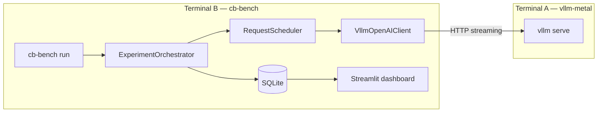

# Architecture walkthrough

How the benchmark harness is structured and how data flows from `vllm serve` on Apple Silicon to the Streamlit dashboard.

← [Project README](../README.md) · [Documentation index](README.md)

---

## Design principles

1. **Server vs client separation** — Continuous batching and speculative decoding are configured in `vllm serve`. This repository is an HTTP client that generates load and records metrics.
2. **Declarative experiments** — E1–E7 are defined in YAML; the orchestrator interprets them without per-experiment boilerplate in the CLI.
3. **Reproducible tagging** — Each run stores `model_key`, checkpoint ID, and `speculative_enabled` so A/B comparisons are unambiguous.
4. **Layered architecture** — Domain types, application logic, and infrastructure (HTTP, SQLite) are separated for testability.

---

## Data flow



---

## Configuration layer

### [`configs/models.yaml`](../configs/models.yaml)

Model registry and server-side speculative profiles:

| Key | Default checkpoint | Speculative |
|-----|-------------------|-------------|
| `gemma-4-e4b` | `mlx-community/gemma-4-e4b-it-bf16` | Draft model |
| `qwen3.5-4b` | `mlx-community/Qwen3.5-4B-MLX-4bit` | MTP (`qwen3_next_mtp`) |

`scripts/serve.sh` reads this file and constructs the `vllm serve` command, including `--speculative-config` JSON.

### [`configs/model.yaml`](../configs/model.yaml)

Active run defaults: `model_key`, `base_url`, token limits. The `speculative_enabled` field is a **tag** for results—it must match how the server was started.

### [`configs/experiments.yaml`](../configs/experiments.yaml)

Defines experiments E1–E7: prompt mixes, sequential vs concurrent modes, concurrency sweeps, and profile overrides (`rigorous`, `smoke`).

---

## Domain layer (`src/continuous_batching/domain/`)

### [`models.py`](../src/continuous_batching/domain/models.py)

Core datatypes:

| Type | Purpose |
|------|---------|
| `PromptSpec` | One prompt from JSONL (`short`, `long`, `reasoning`, `short_long_output`) |
| `RequestSpec` | One HTTP call (experiment, API mode, wave position, concurrency K) |
| `RequestResult` | Per-request metrics (TTFT, E2E, tokens, success) |
| `ScenarioRun` | One scenario execution (requests + memory samples) |
| `RunConfig` | Resolved settings for a benchmark run |

### [`scenarios.py`](../src/continuous_batching/domain/scenarios.py)

- `load_prompts()` — reads `scenarios/prompts/*.jsonl`
- `pick_prompts()` / `build_wave()` — assembles prompt waves per experiment config

### [`model_registry.py`](../src/continuous_batching/domain/model_registry.py)

Loads `configs/models.yaml` into typed `ModelEntry` and `SpeculativeProfile` objects.

---

## Application layer (`src/continuous_batching/application/`)

### [`orchestrator.py`](../src/continuous_batching/application/orchestrator.py)

`ExperimentOrchestrator.run_all()`:

1. Persists run metadata (`model_key`, `speculative_enabled`, checkpoint)
2. Iterates experiments from YAML (`_run_e1` … `_run_e7`)
3. For each scenario, `_execute_scenario()`:
   - Runs warmup requests (discarded)
   - Starts the memory monitor
   - Builds `RequestSpec` lists per repetition and dispatches via the scheduler
   - Saves `ScenarioRun` to SQLite
4. Optionally fetches Prometheus `/metrics` from the server

Supports `--resume-run-id` and `--only-experiment` for partial reruns.

| Experiment | What it tests |
|------------|---------------|
| E1 | Long-only vs long+short mix vs short-only |
| E2 | Long prompt first vs last in a concurrent wave |
| E3 | Reasoning vs long-context input |
| E4 | Short prompts, K = 1, 2, 4, 8, 16 |
| E5 | Short prompt with large `max_tokens` |
| E6 | Chat API vs Completions API |
| E7 | Decode-heavy workload for speculative A/B |

### [`scheduler.py`](../src/continuous_batching/application/scheduler.py)

- `ExecutionMode.SEQUENTIAL` — one request at a time (K=1 baseline)
- `ExecutionMode.CONCURRENT` — `asyncio.Semaphore(K)` caps in-flight requests

This isolates the effect of overlapping client load: concurrent mode presents more work to vLLM's internal batcher simultaneously.

---

## Infrastructure layer (`src/continuous_batching/infrastructure/`)

### [`vllm_client.py`](../src/continuous_batching/infrastructure/vllm_client.py)

`VllmOpenAIClient` wraps the OpenAI Python SDK:

- **Chat** → `/v1/chat/completions`
- **Completions** → `/v1/completions`

Streaming is enabled; time to first chunk = TTFT. `MockInferenceClient` supports unit tests.

### [`monitor.py`](../src/continuous_batching/infrastructure/monitor.py)

Background sampling of process RSS and system memory every 500 ms during each scenario.

### [`store.py`](../src/continuous_batching/infrastructure/store.py)

SQLite schema: `run_metadata`, `scenario_runs`, `request_results`, `system_samples`.

### [`metrics.py`](../src/continuous_batching/infrastructure/metrics.py)

Best-effort GET to `/metrics` when the server exposes Prometheus.

---

## Evaluation and reporting

### [`evaluation/stats.py`](../src/continuous_batching/evaluation/stats.py)

Percentiles, throughput (tok/s, req/s), and `compare_modes()` for sequential vs concurrent analysis.

### [`evaluation/conclusions.py`](../src/continuous_batching/evaluation/conclusions.py)

Rule-based bullet generation for `summary.md` and the dashboard (E4 K sweep, continuous-batching impact, E7 speculative notes).

### [`reporting/export.py`](../src/continuous_batching/reporting/export.py)

Exports `requests.csv`, `summary.csv`, `summary.md`, and `summary.html`.

### [`reporting/dashboard.py`](../src/continuous_batching/reporting/dashboard.py)

Streamlit UI with per-experiment tabs, metric glossary, and run metadata in the sidebar.

---

## CLI

### [`cli.py`](../src/continuous_batching/cli.py)

```bash
cb-bench models
cb-bench run --model gemma-4-e4b --speculative off
cb-bench run --resume-run-id <run_id> --only-experiment E7
cb-bench export --run-id <run_id>
```

`load_run_config()` merges `model.yaml`, CLI flags, and `models.yaml` resolution.

---

## Speculative decoding workflow

Speculative decoding is toggled on the **server**, not in the client:

```bash
# Terminal A
./scripts/serve.sh gemma-4-e4b off
# Terminal B
cb-bench run --model gemma-4-e4b --speculative off

# Restart server with speculative on
./scripts/serve.sh gemma-4-e4b on
cb-bench run --model gemma-4-e4b --speculative on
```

Compare runs in the dashboard: same `model_key`, different `speculative_enabled`. E7 targets decode-heavy prompts under sequential and concurrent modes.

---

## Tests

| Path | Purpose |
|------|---------|
| `tests/unit/test_scheduler.py` | Semaphore K, request ordering |
| `tests/unit/test_stats.py` | Percentiles, throughput |
| `tests/unit/test_model_registry.py` | Model and speculative config loading |
| `tests/unit/test_orchestrator_mock.py` | End-to-end smoke run with mock client |
| `tests/integration/` | Live server smoke test (optional) |

```bash
make test
pytest tests/integration -m integration
```

---

## Suggested reading order

1. `configs/models.yaml` + `configs/experiments.yaml`
2. `domain/models.py` + `domain/scenarios.py`
3. `application/orchestrator.py` — start with `_run_e4` and `_execute_scenario`
4. `application/scheduler.py` + `infrastructure/vllm_client.py`
5. `evaluation/stats.py` + `reporting/dashboard.py`
